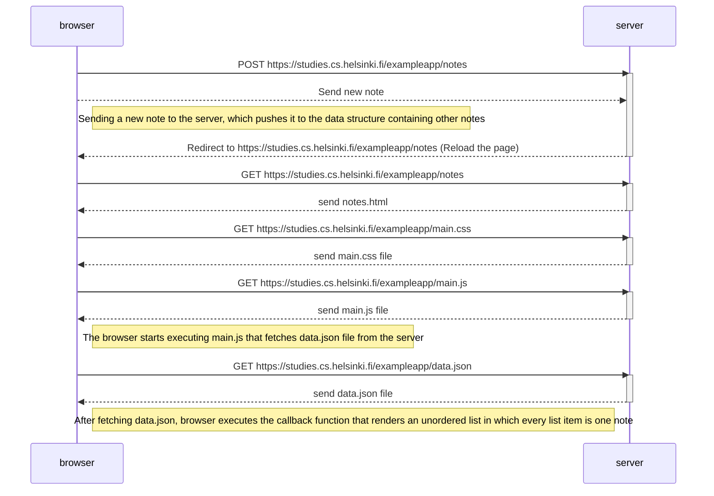

```mermaid
sequenceDiagram
participant browser
participant server

    browser->>server: POST https://studies.cs.helsinki.fi/exampleapp/notes
    activate server
    browser-->>server: Send new note
        Note right of browser: Sending a new note to the server, which pushes it to the data structure containing other notes
    server-->>browser: Redirect to https://studies.cs.helsinki.fi/exampleapp/notes (Reload the page)
    deactivate server

    browser->>server: GET https://studies.cs.helsinki.fi/exampleapp/notes
    activate server
    server-->>browser: send notes.html
    deactivate server

    browser->>server: GET https://studies.cs.helsinki.fi/exampleapp/main.css
    activate server
    server-->>browser: send main.css file
    deactivate server

    browser->>server: GET https://studies.cs.helsinki.fi/exampleapp/main.js
    activate server
    server-->>browser: send main.js file
    deactivate server

    Note right of browser: The browser starts executing main.js that fetches data.json file from the server
    browser->>server: GET https://studies.cs.helsinki.fi/exampleapp/data.json
    activate server
    server-->>browser: send data.json file
    deactivate server

    Note right of browser: After fetching data.json, browser executes the callback function that renders an unordered list in which every list item is one note
```
