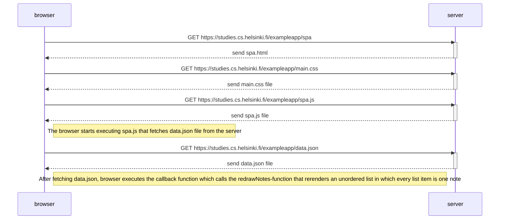

```mermaid
sequenceDiagram
participant browser
participant server

    browser->>server: GET https://studies.cs.helsinki.fi/exampleapp/spa
    activate server
    server-->>browser: send spa.html
    deactivate server

    browser->>server: GET https://studies.cs.helsinki.fi/exampleapp/main.css
    activate server
    server-->>browser: send main.css file
    deactivate server

    browser->>server: GET https://studies.cs.helsinki.fi/exampleapp/spa.js
    activate server
    server-->>browser: send spa.js file
    deactivate server

    Note right of browser: The browser starts executing spa.js that fetches data.json file from the server
    browser->>server: GET https://studies.cs.helsinki.fi/exampleapp/data.json
    activate server
    server-->>browser: send data.json file
    deactivate server

    Note right of browser: After fetching data.json, browser executes the callback function which calls the redrawNotes-function that rerenders an unordered list in which every list item is one note
```
